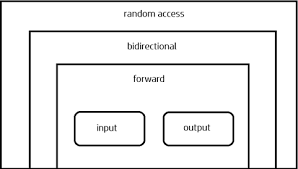

## Introduction
_Alexander Stepanov_ and _Meng Lee_ of Hewlett-Packard developer a set of general-purpose templatized classes (data structures) and functions (algorithms) that could be used as a standard approach for storing and processing of data. The collection of these generic classes and functions is called Standard Template Library (STL). The STL has now become a part of ANSI startard C++ class library. STL components which are now part of the Standard C++ Library are defined in the **namespace std**.

## Components of STL
The STL contains several components. But at its core are three key components. They are:
- **Containers**: A container is an object that actually stores data. It is a way data is organized in memory. The STL containers are implemented by template classes and therefore can be easily customized to hold different types of data.
- **Algorithms**: A algorithm is a procedure that is used to process the data contained in the containers. The STL includes many different kinds of algorithms to provide support to tasks such as initializing, searching, copying, sorting, and merging. Algorithms are implemented by template functions.
- **Iterators**: An iterator is an object (like a pointer) that points to an element in a container. We can use iterators to move through the contents of containers. Iterators are handled just like pointers. We can increment or decrement them. Iterators connect algorithms with containers and play a key role in the manipulation of data stored in the containers.

These three components work in conjunction with one another to provide support to a variety of programming solutions.

## Containers
Containers are objects that hold data (of same type). There are three categories of containers:

### Sequence Containers:
Sequence containers store elements in a linear sequence. Each element is related to other elements by its position along the line. They all expand themselves to allow insertion of elements and all of them support a number of operations on them.

- Vector: A dynamic array. Allows insertions and deletions at back. Permits direct access to any element.
- List: A bidirectional, linear list. Allows insertions and deletions anywhere.
- Deque: A double-ended queue. Allows insertions and deletions at both the ends. Permits direct access to any element.

Elements in all these containers can be accessed using an iterator. The difference between the three of them is related to only their performance.

### Associative Containers
Associative containers are designed to support direct access to elements using keys. They are not sequential.
- Set: An associative container for storing unique sets. Allows rapid lookup. (No duplicates allowed).
- MultiSet: An associative container for storing non-unique sets. (Duplicates allowed).
- Map: An associative container for storing unique key/value pairs. Each key is associated with only one value (one-to-one mapping). Allows key-based lookup.
- MultiMap: An associative container for storing key/value pairs in which one key may be associated with more than one value (one-to-many mapping). Allows key-based lookup.

All these containers store data in a structure called _tree_ which facilitates fast searching, deletion and insertion. However, these are moderately slow for random access and sorting.

Containers **set** and **multiset** can store a number of items and provide operations for manipulating them using the values as the keys. For example, a set might store objects of the student class which are ordered alphabetically using names as keys. We can search for a desired student using his name as the key. The main difference between a set and a multiset is that a multiset allows duplicate items while a set does not.

Container **map** and **multimap** are used to store pairs of items, one called a key and the other called the value. We can manipulate the values using the keys associated with them. The values are sometimes called _mapped values_. The difference between a map and a multimap is that a map allows only one value for a given key to be stored while multimap permits multiple values.

### Derived Containers
- Stack: A standard stack. Last-in-first-out (LIFO).
- Queue: A standard queue. First-in-first-out (FIFO).
- Priority Queue: A priority queue. The first element out is always the highest priority element.

Stacks, Queues and priority queues can be created from different sequence containers. The derived containers do not support iterators and therefore we cannot use them for data manipulation. However, they support two member functions pop() and push() for implementing deleting and inserting operations.

## Algorithms
Algorithms are functions that can be used generally across a variety of containers for processing their contents. Although each container provides functions for its basic operations, STL provides more than sixty standard algorithms to support more extended or complex opertions. Standard algorithms also permit us to work with two different types of containers at the same time. Remember, STL algorithms are not member functions or friends of containers. They are standalone template functions.

STL algorithms reinforce the philosophy of reusability. To have access to the STL algorithms, we must include \<algorithm\> in out programs.

STL algorithms, based on the nature of operations they perform, maybe categorized as under:
- Retrieve or non-mutating algorithms
- Mutating algorithms
- Sorting algorithms
- Set algorithms
- Relational algorithms

## Iterators
Iterators behave like pointers and are used to access container elements. They are often used to traverse from one element to another, a process known as _iterating_ through the container.

There are five types of iterators as describe below:

| Iterator | Access Method | Direction of movement | I/O capability | Remark |
| -------- | ------------- | --------------------- | -------------- | ------ |
| Input | Linear | Forward Only | Read Only | Cannot be saved |
| Output | Linear | Forward Only | Write Only | Cannot be saved |
| Forward | Linear | Forward Only | Read/Write | Can be saved |
| Bidirectional | Linear | Forward and backward | Read/Write | Can be saved |
| Random | Random | Forward and backward | Read/Write | Can be saved |

Different types of iterator must be used with the different types of containers. Note that only sequence and associative containers are traversable with iterators.

Each type of iterator is used for performing certain functions. Below figures gives the functionality Venn diagram of the iterators. It illustrates the level of functionality provided by different categories of iterators.



The input and output iterators support the least functions. They can be used only to traverse in a container. The forward iterator supports all operations of input and output iterators and also retains its position in the container. A bidirectional iterator, while supporting all forward iterator operations, provides the ability to move in the backward direction in the container. A random access iterator combines the functionality of a bidirectional iterator with an ability to jump to an arbitrary location.

## Function Objects
A function object is a function that has benn wrapped in a class so that it looks like an object. The class has only one member function, the overloaded () operator and no data. The class is templatized so that it can be used with different data types.

Function objects are often used as arguments to certain containers and algorithms. For example,the statement

```cpp
sort(array, array+5, greater<int>())
```

uses the function object `greater<int>()` to sort the elements contained in array in descending order.

Besides comparisons, STL provides many other predefined function objects for performing arithmetical and logical operations as shown in table below. Note that there are function objects corresponding to all the major C++ opertors. For using function objects, we must include \<functional\> header file.

|Function Object|Type|Description|
|---|---|:---:|
|divides<T>|arithmetic|x / y|
|equal_to<T>|relational|x == y|
|greater<T>|relational|x > y|
|greater_equal<T>|relational|x >= y|
|less<T>|relational|x < y|
|less_equal<T>|relational|x <= y|
|logical_and<T>|logical|x && y|
|logical_not<T>|logical|!x|
|logical_or<T>|logical|x || y|
|minus<T>|arithmetic|x - y|
|modulus<T>|arithmetic|x % y|
|negate<T>|relational|-x|
|not_equal_to<T>|arithmetic|x != y|
|plus<T>|arithmetic|x + y|
|multiplies<T>|arithmetic|x * y|

**Note:** The variables x and y represent objects of class T passed to the function object as arguments.